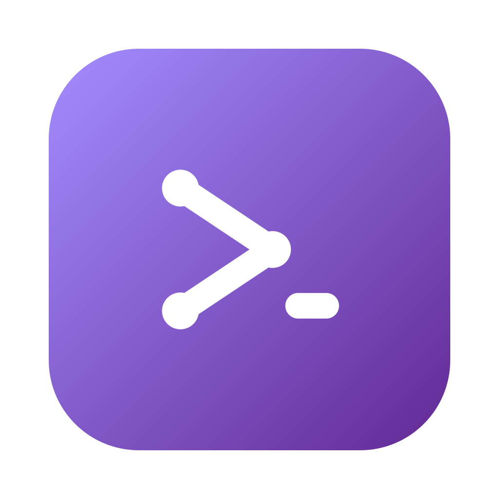
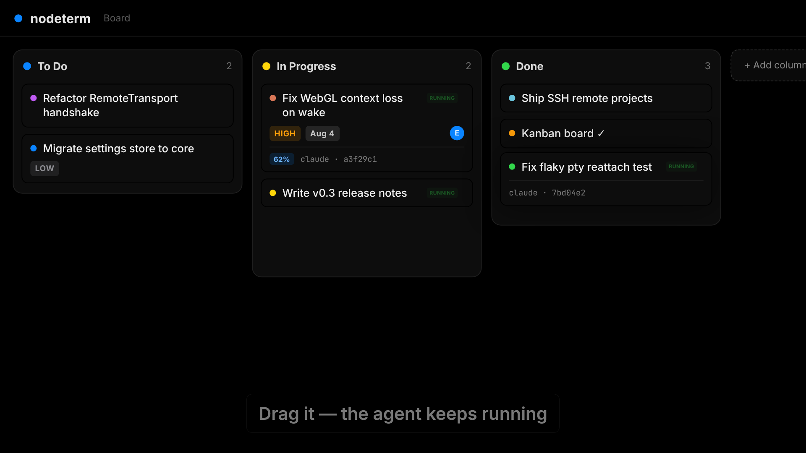
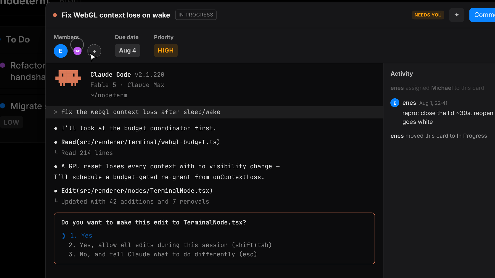
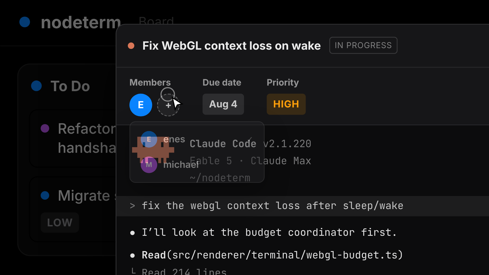

<div align="center">



# nodeterm

**A node-based terminal manager — your terminals and agents on an infinite canvas.**

Multiple real terminals live as draggable nodes on a single pan/zoom canvas, and every
project doubles as a **Trello-style board of live Claude Code sessions**. Built for
people with ADHD and scattered workflows: a spatial layout instead of a stack of
hidden tabs.

[%20·%20Linux%20(x64)-black)](https://nodeterm.dev)
[](https://www.electronjs.org/)
[](./LICENSE)
[](https://github.com/eneskirca/nodeterm/stargazers)
[](https://github.com/eneskirca/nodeterm/releases)

[Download](#-download) · [Docs](https://nodeterm.dev/docs) · [Features](#-features) · [Build from source](#-build-from-source) · [Architecture](#-architecture) · [License](#-license)

</div>

---

<div align="center">
  <a href="docs/assets/kanban-launch.mp4">
    
  </a>
  <br/>
  <sub>▶ <a href="docs/assets/kanban-launch.mp4">Watch the launch video with sound</a></sub>
</div>

## Why nodeterm

Stacked terminal tabs hide context — you lose track of what's running where. nodeterm
turns that into a **map**: every shell is a node you can place, group, label, and zoom
into. Sessions are spatial and persistent, so your mental model stays intact across
restarts. And because the app is built around a clean service seam, the same canvas runs
three ways — as the **desktop app for macOS and Linux**, as a **self-hosted browser app**
you reach from anywhere (Server Edition), and an **iOS companion** that attaches to the
same live sessions.

📚 **Full documentation lives at [nodeterm.dev/docs](https://nodeterm.dev/docs)** — get
started, concepts, agents, remote access, troubleshooting.

## ✨ Features

<table>
<tr>
<td width="42%" valign="middle">

### One project, two views

Every project is a canvas — **and also a kanban board**. Cards *are* your live
sessions: drag them across columns while the agent keeps running, see pulsing
**RUNNING** / **NEEDS YOU** badges and each agent's context meter at a glance, and
add columns to match your flow. Toggle with `⌘⇧B`.

</td>
<td></td>
</tr>
<tr>
<td width="42%" valign="middle">

### Every card is a live Claude Code session

Click a card and the **real session opens in a Trello-style card modal** — the same
tmux-backed terminal, live. Answer a permission prompt right there, search the
scrollback, dictate into it, and keep per-card **comments & activity** alongside
members, due date, and priority.

</td>
<td></td>
</tr>
<tr>
<td width="42%" valign="middle">

### Built for teams of humans *and* agents

Assign teammates to cards, set due dates and priorities, and comment — the board's
activity feed is a git-shareable file in your repo, so everyone (and every agent)
sees the same board. Agents can organize the canvas too: spawn a team, wire
dependencies, and read each other's transcripts.

</td>
<td></td>
</tr>
</table>

### Everything is a node

Right-click the canvas to open a terminal — or an AI agent. Each one runs in its own
persistent tmux session, on one pan/zoom canvas:

- 🖥 **Terminal** — xterm + tmux, click-to-rename, color, tags, AI naming.
- 🤖 **Agent** — a terminal preset that launches an agent CLI: **Claude Code**, **Codex**,
  **Gemini**, **opencode**, or your own custom command.
- 📝 **Sticky note** — free-text colored notes; link one to an agent to feed it context.
- 🗂 **Group** — frame and move related nodes together; bind a group to a **git worktree**
  for an agent-per-branch layout.
- ✏️ **Editor** — Monaco code editor for a file (⌘S to save, markdown/image preview).
- 🔀 **Diff** — Monaco diff editor for staged/unstaged changes.
- 🌐 **Web / Video** — render a page or a video right on the canvas.

### Know when an agent needs you

Hook-driven agent status — no output scraping: pulsing **RUNNING / NEEDS YOU** badges,
**subagent** cards with live transcripts, a **context-window meter**, unread dots, and
OS notifications when an agent finishes (or gets stuck on an approval) while you're
somewhere else. On a MacBook, the **notch** grows into a tiny status capsule: a walking
mascot per working agent, a red dot when one needs you.

### More

- **Session continuity (tmux)** — terminals keep running across node remounts *and* full
  app restarts, including live processes; machine reboots restore scrollback and resume
  agent sessions (`claude --resume`).
- **Talk to your terminal** — on-device Whisper dictation (⌘⇧D): speak, review, send.
- **Agent superpowers** — **context links** so agent nodes read each other's transcripts
  on demand; Claude-only **branch a conversation** and **managed accounts** for several
  logged-in Claude identities side by side; agents can drive the canvas (open nodes,
  spawn teams, verify each other's work) via the built-in canvas-control CLI.
- **Remote / SSH projects** — open a project on a remote host over SSH; terminals, files,
  git, and even the board run there while the canvas stays local.
- **Source control** — VS Code-style stage/unstage, discard, branch switch/create,
  commit, push/sync/publish, **worktrees**, and `gh` sign-in — backed by system `git`.
- **AI commit messages & terminal names** — bring-your-own local agent CLI run read-only
  on the staged diff or captured output.
- **Your sessions, in your pocket** — **nodeterm mobile** (iOS) attaches to the same live
  tmux sessions: watch an agent work, answer a "needs you", or type into any terminal
  from your phone — plus push notifications and a mobile board view.
- **Command palette** (⌘K), **file explorer** (⌘⇧E), **markdown view** (⌘M),
  **undo/redo**, and a native macOS dark UI.
- **Auto-update & in-app announcements** — the app checks a self-hosted feed and
  surfaces a "Restart to update" banner and product news.

### 🌍 Server Edition — nodeterm in your browser

The same canvas runs headless on a Linux (or macOS) host and is used from any browser —
so your terminals, editors, source control, board, and agents live on a server you reach
from anywhere. Single-user auth (password + secure cookie), a WebSocket bridge, and the
exact same renderer as the desktop app.

```bash
npm run server:dev     # build + serve; open http://127.0.0.1:8443 and set a password
```

Terminals, files/editor/diff, the full git panel, the kanban board, and agent-status
badges all work in the browser today. See [`docs/SERVER.md`](./docs/SERVER.md) for the
quickstart, security model, and current limitations.

#### 🔔 Get push notifications from any SSH host

The same server also runs **headless** as a background notification host: install it on any
Linux box you SSH into, and your phone gets **RUNNING / NEEDS YOU** push + Live-Activity
coverage for the agents running there — with **zero open ports** (the hook server stays
loopback-only and push goes out over HTTPS under a grant your phone drops over SSH).

```bash
curl -fsSL https://raw.githubusercontent.com/eneskirca/nodeterm/main/scripts/install-server.sh | bash
```

One line installs, builds, and runs it as a systemd service (`NODETERM_HEADLESS=1`); re-run it
to update. See the [headless notification host](./docs/SERVER.md#headless-notification-host)
section for details.

## 📦 Download

Grab the latest build from **[nodeterm.dev](https://nodeterm.dev)** — the download button
detects your platform. Everything is also listed at
[nodeterm.dev/releases](https://nodeterm.dev/releases):

- **macOS** — `.dmg` for Apple Silicon and Intel (auto-updates).
- **Linux (x64)** — self-updating **AppImage**, or a `.deb` for Debian/Ubuntu
  (`sudo apt install ./nodeterm-*.deb`; updates are manual for `.deb`).
- **iOS** — **nodeterm mobile** on the [App Store](https://nodeterm.dev/mobile).

> Until the macOS build is signed & notarized, Gatekeeper may warn on first launch —
> right-click the app → **Open** to bypass it once.

## 🛠 Build from source

Requires Node.js 20+ on macOS or Linux (tmux recommended — it's what makes sessions
survive restarts).

```bash
npm install        # deps + rebuilds node-pty against Electron's ABI (postinstall)
npm run dev        # dev mode with renderer HMR
npm run build      # production build into out/
npm start          # preview the production build
npm run typecheck  # fastest correctness gate
npm test           # vitest unit + integration suite
npm run dist       # local UNSIGNED .dmg into dist/ (smoke test)
npm run dist:linux # AppImage + .deb into dist/ (on a Linux host)
npm run server:dev # build + run the browser Server Edition (needs Node 22 + tmux)
```

## ⌨️ Keyboard shortcuts

| Shortcut | Action |
| --- | --- |
| `⌘K` | Command palette |
| `⌘T` / `⌘⇧C` | New terminal / New Claude Code |
| `⌘⇧B` | Toggle the kanban board |
| `⌘W` | Close the selected node |
| `⌘Z` / `⌘⇧Z` | Undo / Redo |
| `⌘M` | Toggle markdown view (terminal / editor) |
| `⌘⇧D` | Dictate into the focused terminal |
| `⌘⇧E` | File explorer |
| `⌘,` | Settings · `⌘/` Shortcuts |
| `Right-click` | Actions menu (empty space or node) |

## 🏗 Architecture

- **Electron, three contexts** — `src/main` (the Electron shell), `src/preload` (the only
  bridge, `window.nodeTerminal`), `src/renderer` (React UI). `src/shared` holds the types
  and IPC channel names used by all three.
- **`CorePlatform` seam** — every service (PTY, workspace/settings, git, agents, hooks) lives
  in `src/core` behind a small platform interface and never imports `electron`. Electron is
  one implementation of that seam; the browser Server Edition (`src/server`) is another,
  booting the exact same services over a WebSocket-RPC bridge (`src/renderer/bridge` fills
  `window.nodeTerminal` in the browser). One codebase, one renderer, multiple shells.
- **`TerminalTransport` abstraction** — the renderer depends only on this interface, never on
  IPC or node-pty directly. `LocalTransport` talks to the local host; `RemoteTransport` talks
  to a remote agent over SSH — so remote projects drop in without touching the canvas UI.
- **React Flow is the single source of truth** for live nodes; projects persist serialized
  nodes to disk, and tmux keeps sessions alive across restarts.
- **Three surfaces** — the desktop app, the browser **Server Edition**, and the
  **mobile companion** (a separate SwiftUI repo) all ride the same core + transport seams.

See [`docs/SERVER.md`](./docs/SERVER.md) for the Server Edition, and the design docs
under [`docs/`](./docs) for deeper notes.

## 🤝 Contributing

Issues and pull requests are welcome. Questions or bug reports are also happy at
[nodeterm.dev/support](https://nodeterm.dev/support) / support@nodeterm.dev. nodeterm is licensed under the
[Business Source License 1.1](https://mariadb.com/bsl11/) — you can use, modify,
and redistribute it freely, including in production, except offering it as a
competing product or service (see [License](#-license)).

By submitting a contribution (pull request, patch, or code snippet), you agree
that it is licensed under the same [BUSL-1.1](./LICENSE) terms as the rest of
the project, and that the project may continue to relicense future versions
(including your contribution) as part of its normal licensing model.

## 📜 License

**[BUSL-1.1](./LICENSE)** ([Business Source License](https://mariadb.com/bsl11/)): you may
copy, modify, redistribute, and — under the Additional Use Grant — make **production
use** of nodeterm; the one thing you may not do is offer it (hosted, embedded, or as a
standalone product/service) in a way that **competes** with nodeterm or with the
Licensor's products built on it. Each release automatically becomes plain **MIT** four
years after it is published. See [`LICENSE`](./LICENSE) for the full terms and
[`THIRD-PARTY-NOTICES.md`](./THIRD-PARTY-NOTICES.md) for the bundled open-source
components. For a commercial license beyond the grant, contact eneskirca@gmail.com.

> "Claude" and "Claude Code" are trademarks of Anthropic, and "Trello" is a trademark of
> Atlassian; nodeterm is not affiliated with or endorsed by either.
